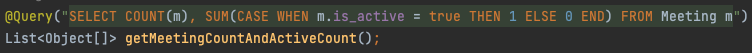
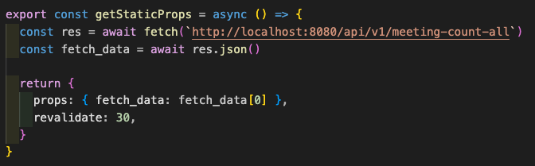

# [JPA] Getting multiple values from columns



```java
List<Object[]> = {{10, 20}}
```
`List<Object[]>` receives nested array from the `@Query` method as above.


## Client
  

`console.log(fetch_data[0])` prints `[10, 20]`.