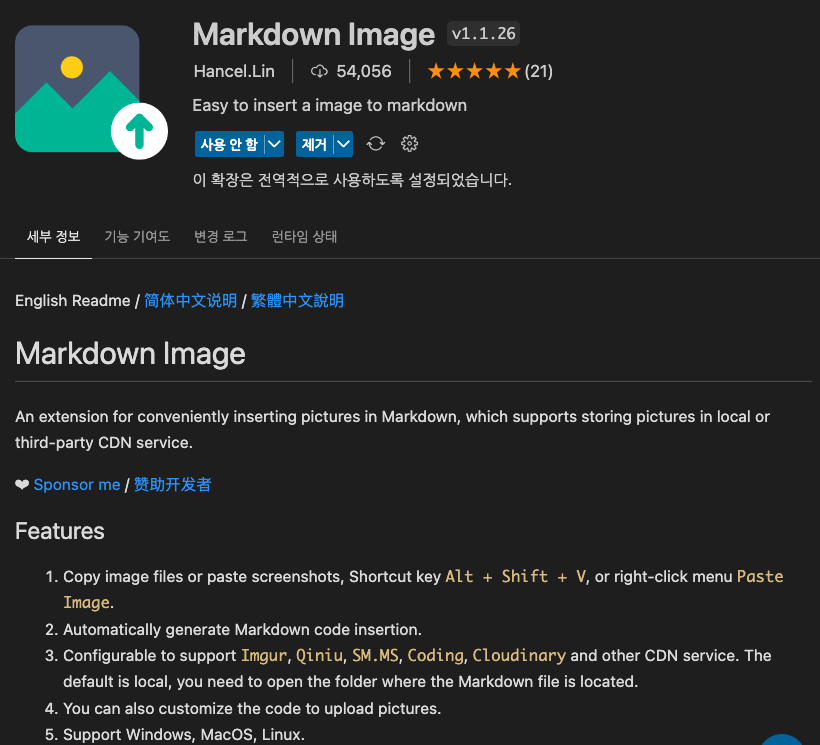
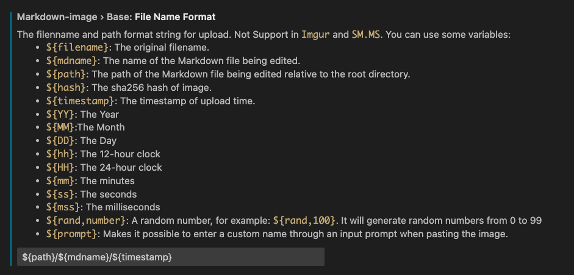
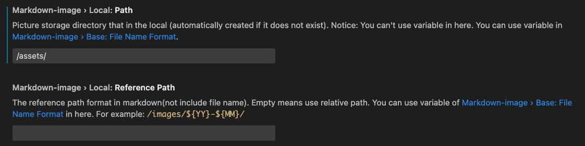
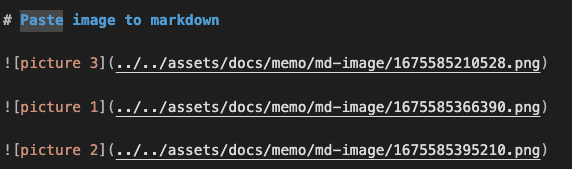
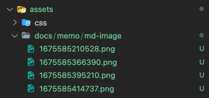

# Paste image to markdown

| `Markdown Image`라는 vscode Extension 을 설치하면 Mac에서 `Alt + Shift + V` 로 클립보드의 이미지를 붙여넣을 수 있다.

{: width="600"}

### 파일명 설정

{: width="600"}

### 이미지를 저장할 경로 설정

{: width="600"}

### md 파일 안에 붙여넣은 모습

{: width="600"}

### 설정한 경로에 맞게 파일이 저장된다.

{: width="600"}
